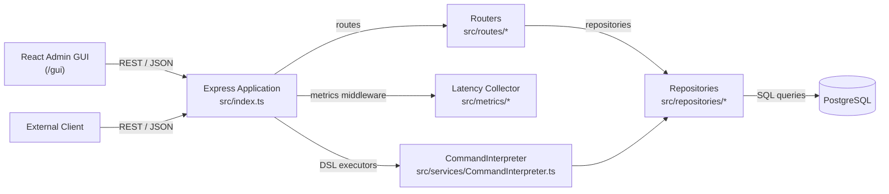
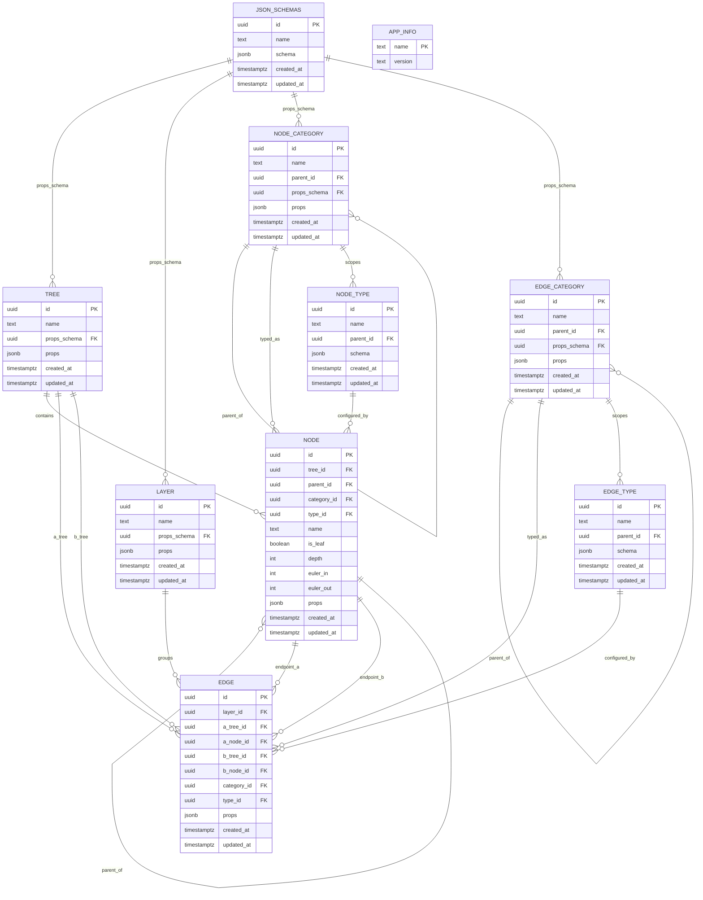
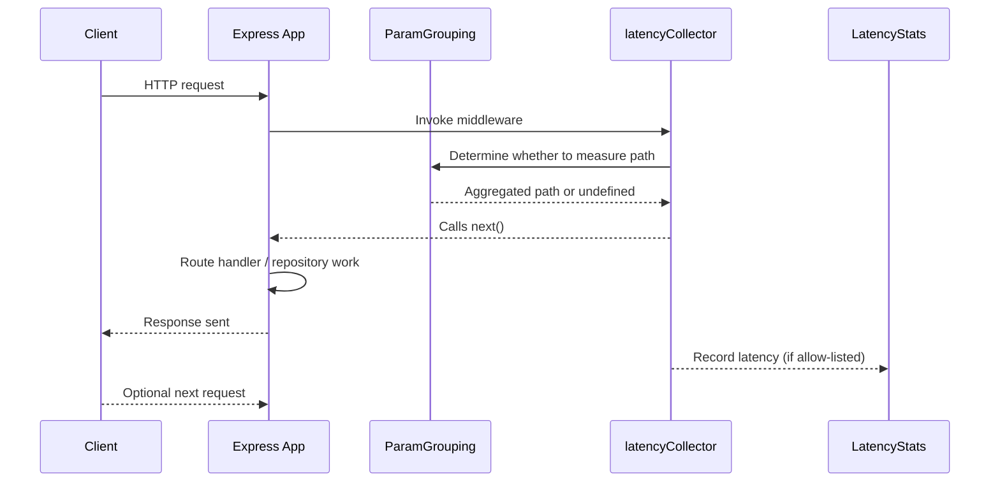
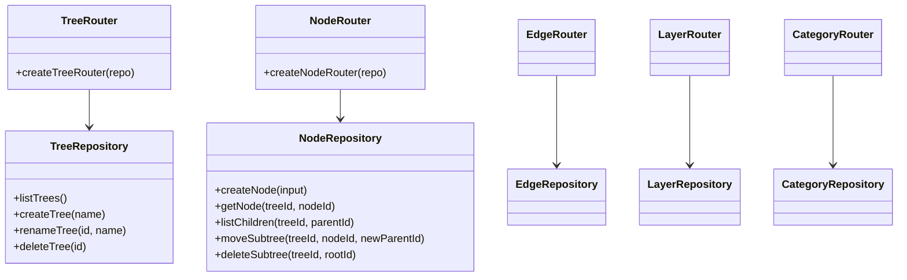
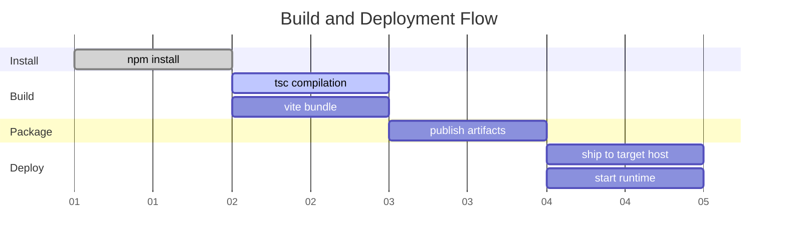
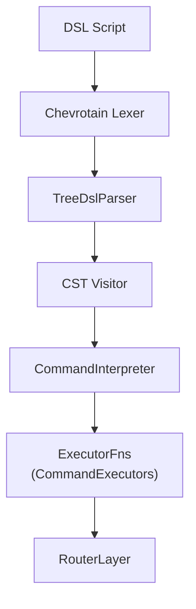

# Refactor Service Platform

Refactor is a TypeScript codebase that combines an Express API, a PostgreSQL persistence layer, and a React/Vite administration console for managing hierarchical "tree" data, typed categories, cross-layer edges, and operational metrics. The project ships with a programmable DSL console, automatic latency tracking, and development helpers for quickly bootstrapping database schemas.

## System Highlights
- Node.js + Express REST API backed by Drizzle ORM and PostgreSQL.
- Domain model for trees, nodes, layers, edges, node and edge categories, node and edge types, plus shared JSON schemas with Euler-tour metadata (`euler_in` / `euler_out`) for fast hierarchy queries.
- Command Interpreter DSL (built on Chevrotain) for scripted data manipulation via HTTP or the GUI console.
- React Admin GUI (Material UI, CodeMirror) for service monitoring, environment inspection, and DSL execution.
- Built-in latency metrics collection with configurable path grouping and a `/api1/metrics` endpoint.
- Dev-only schema management endpoints available at `/api/db/*`.

## Module Documentation
- [`docs/app.md`](docs/app.md): Express bootstrap, dependency injection, middleware, and server lifecycle.
- [`docs/database.md`](docs/database.md): Schema definitions, Drizzle types, and development helpers.
- [`docs/repositories.md`](docs/repositories.md): Details for each repository class and associated tests.
- [`docs/routes.md`](docs/routes.md): Endpoint catalogue with validation and behavior notes.
- [`docs/metrics.md`](docs/metrics.md): Latency instrumentation and metrics API surface.
- [`docs/services.md`](docs/services.md): Command interpreter internals, executors, and environment collection.
- [`docs/gui.md`](docs/gui.md): React/Vite admin console architecture and views.

## Architecture Overview


## Data Model


## Request + Metrics Lifecycle


## Repository & Router Contracts


## API Surface

| Method | Path | Description |
| ------ | ---- | ----------- |
| `GET` | `/` | Look up the `refactor` record in `app_info`. |
| `GET` | `/api1` | API probe endpoint. |
| `GET` | `/api1/env` | Collect host/process diagnostics via `CollectEnvData`. |
| `GET` | `/api1/tree/` | List all trees. |
| `POST` | `/api1/tree/` | Create a tree (body: `{name}`) |
| `PUT` | `/api1/tree/:treeId` | Rename a tree. |
| `DELETE` | `/api1/tree/:treeId` | Delete a tree. |
| `GET` | `/api1/node/:treeId/` | List nodes by parent (optional `parentId`). |
| `GET` | `/api1/node/:treeId/all` | Flattened nodes ordered by Euler tour. |
| `POST` | `/api1/node/:treeId/` | Create node; supports positioning & categories. |
| `GET` | `/api1/node/:treeId/item/:nodeId` | Fetch a single node. |
| `PATCH` | `/api1/node/:treeId/item/:nodeId` | Rename, re-position, or re-type a node. |
| `GET` | `/api1/node/:treeId/item/:nodeId/path` | Path from node back to tree root. |
| `GET` | `/api1/node/:treeId/item/:nodeId/subtree` | Retrieve a subtree (optional `maxDepth`). |
| `POST` | `/api1/node/:treeId/item/:nodeId/move` | Move a subtree to new parent. |
| `DELETE` | `/api1/node/:treeId/item/:nodeId` | Delete node subtree. |
| `GET` | `/api1/node/:treeId/by-type/:type` | Filter nodes by JSONB `props.type`. |
| `POST` | `/api1/node/:treeId/item/:nodeId/counter` | Increment JSONB counter field. |
| `GET` | `/api1/node-categories/` | List categories (optional `parentId`). |
| `POST` | `/api1/node-categories/` | Create category with optional props. |
| `GET` | `/api1/node-categories/:categoryId` | Fetch by ID or `?name=`. |
| `PATCH` | `/api1/node-categories/:categoryId` | Update name, props, or hierarchy. |
| `DELETE` | `/api1/node-categories/:categoryId` | Delete category. |
| `GET` | `/api1/layer/` | List layers. |
| `POST` | `/api1/layer/` | Create a layer. |
| `GET` | `/api1/layer/:layerId` | Fetch layer details. |
| `PUT` | `/api1/layer/:layerId` | Rename a layer. |
| `DELETE` | `/api1/layer/:layerId` | Delete a layer. |
| `GET` | `/api1/edge/` | List edges (optional `layerId` query). |
| `POST` | `/api1/edge/:layerId` | Create edge within a layer. |
| `GET` | `/api1/edge/item/:edgeId` | Fetch single edge. |
| `PATCH` | `/api1/edge/item/:edgeId` | Update edge metadata. |
| `DELETE` | `/api1/edge/item/:edgeId` | Delete edge. |
| `GET` | `/api1/metrics` | Snapshot latency metrics. |
| `POST` | `/api1/metrics/reset` | Clear latency history. |
| `POST` | `/api2/console` | Execute DSL script via `CommandInterpreter`. |
| `POST` | `/api/db/reset|create|drop` | Dev-only schema lifecycle (guarded). |
| `GET` | `/gui/*` | Serve the built React admin console. |

## Environment & Configuration

| Variable | Default | Purpose |
| -------- | ------- | ------- |
| `PORT` | `3000` | HTTP listener for Express. |
| `PGHOST` / `POSTGRES_HOST` | `localhost` | PostgreSQL host. |
| `PGPORT` / `POSTGRES_PORT` | `5432` | PostgreSQL port. |
| `PGDATABASE` / `POSTGRES_DB` | `refactor` | Database name. |
| `PGUSER` / `POSTGRES_USER` | `refactor` | Database user. |
| `PGPASSWORD` / `POSTGRES_PASSWORD` | `refactor` | Database password. |
| `NODE_ENV` | `development` | Controls dev/prod behavior (e.g., schema API). |

## NPM Scripts

| Script | Description |
| ------ | ----------- |
| `npm install` | Install backend + frontend dependencies. |
| `npm run build` | Compile TypeScript (`dist/`) and build the GUI bundle (`src/renderer`). |
| `npm run build:gui` | Build only the Vite React frontend. |
| `npm run dev:gui` | Launch Vite development server for the GUI. |
| `npm test` | Run Jest test suite for repositories and API wiring. |
| `npm run test:watch` | Jest in watch mode. |

## Local Development Workflow
1. **Provision PostgreSQL:** create a database named `refactor` (or override connection env vars).
2. **Install dependencies:** `npm install`.
3. **Build artifacts:** `npm run build`. This outputs the server bundle (`dist/`) and GUI assets (`dist/gui/` via Vite).
4. **Start the server:** `node dist/index.js` or integrate with a process manager. The admin UI is available at `http://localhost:3000/gui`.
5. **Initialize schema (dev):** POST to `/api/db/reset` to recreate tables and triggers. Avoid enabling this in production.
6. **Run tests:** `npm test` (Jest + ts-jest).

## Build & Deploy Timeline


## Command Interpreter DSL
Chevrotain powers a DSL for scripted data creation. Scripts can be executed via `/api2/console` or the GUI "Terminal" view.



Example script:

```text
create tree "Demo Tree" props '{"label":"demo"}';
create category "Folder" parent "root" props '{"color":"#0088ff"}';
create node "Root" parent "root" category "Folder" props '{"type":"folder"}';
repeat 3 ["$name-$i"]
  create node "Child-$$" parent "Root" category "Folder" props '{"type":"item"}';
```

Use `$0` / `$$` placeholders inside `repeat` blocks to reference the iteration index and positional parameters.

## Observability
- `latencyCollector` wraps Express responses and records request duration only for allow-listed patterns (configured in `src/index.ts`).
- `ParamGrouping` normalizes parameterized routes to reduce cardinality.
- `LatencyStats` exposes aggregated min/max/avg metrics; retrieving `/api1/metrics` is safe for dashboards, and `POST /api1/metrics/reset` clears history.
- `CollectEnvData` reports diagnostic snapshots at `/api1/env` for quick environment introspection.

## Frontend Console
- **Service Overview:** fetches `/api1/env` to display system data (CPU, memory, interfaces).
- **Terminal:** runs DSL scripts client-side and streams logs from `CommandInterpreter`.
- **Tester:** allows uploading JSON files, editing them in CodeMirror, and piping content through DSL executors.

## Testing
Unit tests (Jest + ts-jest) cover repository behavior, API wiring, and schema operations:

- `__tests__/treeRepository.test.ts` validates the Drizzle query builder interactions used by the tree repository.
- `__tests__/db-utils.test.ts` exercises shared helpers such as patch sanitization.

Execute `npm test` to run the suite; repository tests rely on mocked Drizzle builders for deterministic assertions.

## Operational Considerations
- The dev schema endpoints (`/api/db/*`) drop and recreate tables; use them cautiously in production environments.
- Ensure the `pgcrypto` extension is enabled; `DevSchema.createAll` will attempt to install it.
- Euler tour indices (`euler_left`, `euler_right`, `euler_depth`) must remain consistent—use repository helpers instead of raw SQL updates to maintain tree integrity.
- Edges reference nodes across layers; enforce referential integrity by using repository methods that wrap operations inside transactions where critical (e.g., `moveSubtree`).
