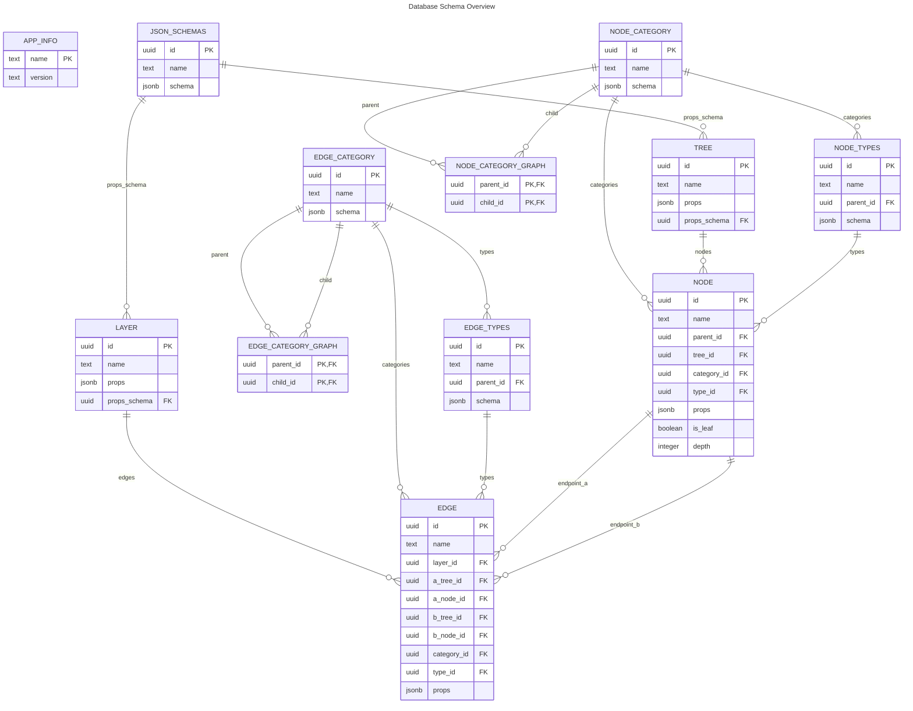

# Database Layer (`src/db`)

The database module defines the canonical schema (TypeScript types plus SQL bootstrap helpers) used across repositories and tests.

## Type Definitions (`src/db/types.ts`)

- `AppInfoTable`, `JsonSchemasTable`, `TreeTable`, `LayerTable`, `EdgeCategoryTable`, `NodeCategoryTable`, `NodeCategoryGraphTable`, `EdgeTypeTable`, `NodeTypeTable`, `NodeTable`, and `EdgeTable` model the PostgreSQL schema using Kysely column types.
- Legacy aliases (`Tree`, `Node`, etc.) wrap the core table interfaces with `Selectable`, `Insertable`, and `Updateable` helpers.
- JSONB columns use `JSONColumnType` to keep strong typing (`TreeProps`, `LayerProps`, `EdgeCategorySchema`, `NodeCategorySchema`, `NodeProps`, `EdgeProps`).
- Euler tour metadata uses `euler_in`, `euler_out`, and `depth` to support hierarchical queries.

> Keep the diagram below in sync whenever the database schema changes.

### Entity Relationship Diagram

## Development Schema Utilities (`src/db/schema.dev.ts`)

`DevSchema` exposes `resetAll`, `createAll`, and `dropAll` helpers executed via SQL statements inside Kysely:

- Installs `pgcrypto` to provide `gen_random_uuid`.
- Creates tables with UUID primary keys, JSONB columns, and shared `updated_at` triggers.
- Adds indexes that match the bootstrap SQL scripts:
  - Naming lookup indexes: `idx_json_schemas_name`, `idx_tree_name`, `idx_layer_name`, `idx_edge_category_name`, `idx_edge_types_name`, `idx_node_category_name`, `idx_node_types_name`, `idx_node_name`, `idx_edge_name`.
  - Hierarchy helpers: `ix_node_tree_in_out`, `ix_node_parent`, `ix_node_depth`, `ix_node_leaf_in`.
  - Edge traversal helpers: `ux_edge_layer_pair`, `ix_edge_layer_a`, `ix_edge_layer_b`, `ix_edge_layer_ab`.
- Enforces edge integrity through `edge_endpoints_order` and `edge_no_self` constraints.
- Keeps a dedicated `dropAll` path so the creation helper can assume a clean database.

### Table Overview

| Table | Purpose | Highlights |
| ----- | ------- | ---------- |
| `app_info` | Stores the application name and bootstrap version | Single-row metadata for migrations |
| `json_schemas` | Registry of JSON Schemas reused by other tables | `schema` JSONB payload, name index |
| `tree` | Root entity for hierarchical content | `props` JSONB, `props_schema` FK to `json_schemas` |
| `layer` | Logical grouping for edges | Shares the same props/schema pattern as `tree` |
| `edge_category` | Categorisation shared across layers | Stores a JSON `schema`; relationships maintained via `edge_category_graph` |
| `edge_category_graph` | Helper table for edge category relationships | Composite PK on (`parent_id`, `child_id`), prevents self-links |
| `edge_types` | Edge wiring definitions | `parent_id` link to `edge_category`, `schema` JSONB, timestamp tracking |
| `node_category` | Categorisation for nodes | Stores a JSON `schema`; relationships maintained via `node_category_graph` |
| `node_category_graph` | Helper table for node category relationships | Composite PK on (`parent_id`, `child_id`), prevents self-links |
| `node_types` | Node wiring definitions | `parent_id` link to `node_category`, referenced by `node.type_id`, `schema` JSONB |
| `node` | Nodes inside a tree hierarchy | Optional links to `tree`, `node_category`, `node_types` via `type_id`, Euler tour columns |
| `edge` | Connections between pairs of nodes | Categorised via `category_id`, `type_id`; symmetry constraints plus traversal indexes |

### Triggers
A shared `set_updated_at` trigger updates the `updated_at` column on every `UPDATE` across the core tables, keeping timestamps consistent.

## Data Access Patterns

- Repositories rely on Kysely to build composable SQL queries, benefitting from type inference provided by these interfaces.
- JSON columns remain schemaless but strongly typed in TypeScript; repository methods apply application-level validation where needed.
- Euler tour fields (`depth`, `euler_in`, `euler_out`) enforce subtree integrity; helper methods in `NodeRepository` centralise the update logic.
